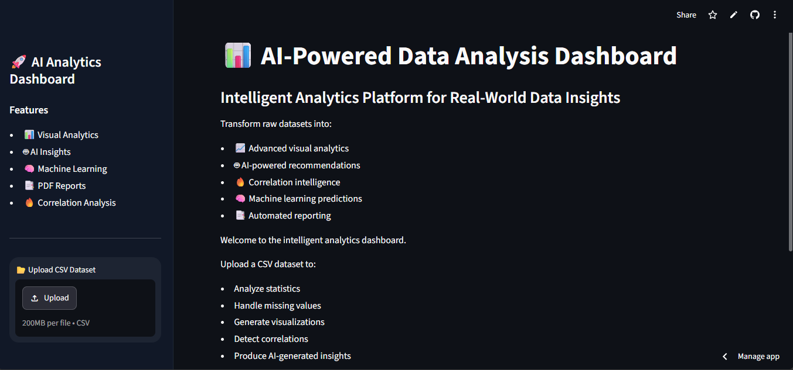
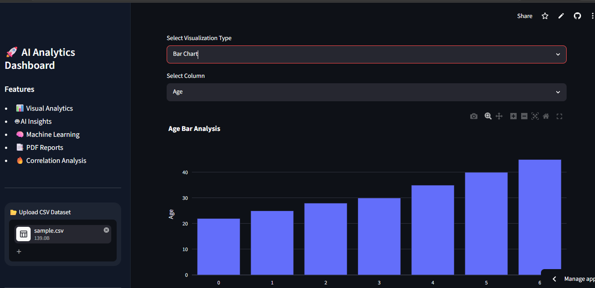
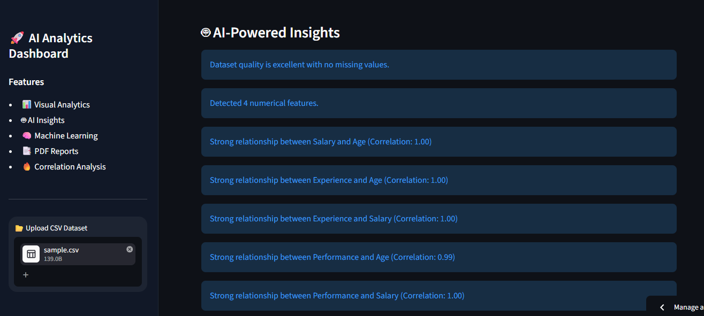
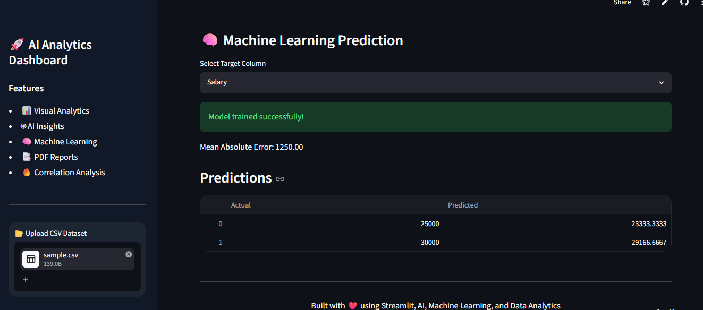
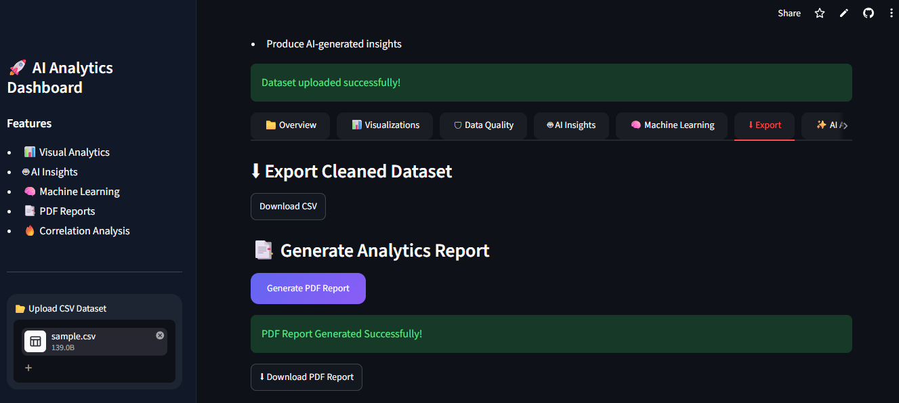
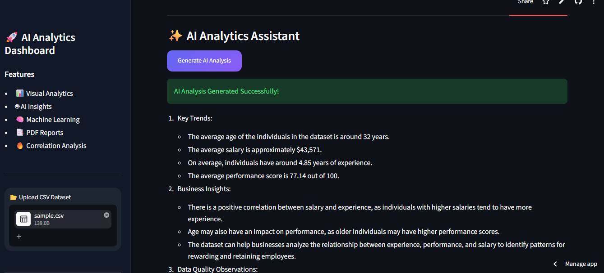

# 📊 AI-Powered Data Analysis Dashboard

## 🚀 Project Overview

The **AI-Powered Data Analysis Dashboard** is a professional analytics platform developed using **Python**, **Streamlit**, **Machine Learning**, and **AI Integration**.

This application allows users to upload CSV datasets and automatically perform:

* Data preprocessing
* Exploratory Data Analysis (EDA)
* Interactive visualizations
* Correlation analysis
* Data quality inspection
* Machine learning predictions
* AI-generated analytical insights
* PDF report generation

The dashboard is designed to dynamically support multiple dataset structures including:

* Numeric datasets
* Categorical datasets
* Mixed datasets
* Real-world business datasets

The system automatically adapts to uploaded CSV files and provides meaningful analytics with an interactive and modern user interface.

---

# 🌐 Live Demo

🔗 Live Application:

https://ai-powered-data-analysis-dashboard.streamlit.app/

---

# ✨ Key Features

## 📂 1. Universal CSV Upload System

* Upload any CSV dataset dynamically
* Supports multiple encodings
* Handles missing values automatically
* Removes fully empty rows and columns
* Compatible with mixed data types

---

## 📈 2. Dataset Overview & Profiling

The dashboard provides complete dataset profiling including:

* Total Rows
* Total Columns
* Missing Values
* Duplicate Rows
* Data Types
* Unique Values
* Column Information
* Statistical Summary

This helps users quickly understand dataset structure and quality.

---

## 📊 3. Interactive Visual Analytics

The application generates interactive charts automatically based on dataset structure.

### Supported Visualizations

* Histogram
* Scatter Plot
* Line Chart
* Box Plot
* Bar Chart
* Correlation Heatmap

### Features

* Dynamic column selection
* Automatic numeric/categorical detection
* Responsive interactive charts
* Real-time rendering

---

# 🔥 4. Correlation Analysis

The dashboard automatically detects numeric columns and generates:

* Correlation matrices
* Heatmaps
* Feature relationship analysis

This helps identify:

* Strongly related variables
* Trends
* Data dependencies

---

# 🛡 5. Data Quality Analysis

The system evaluates dataset quality by identifying:

* Missing values
* Duplicate records
* Invalid entries
* Empty columns
* Data inconsistencies

This improves preprocessing before machine learning analysis.

---

# 🤖 6. AI-Powered Insights

The dashboard integrates AI using OpenRouter/OpenAI-compatible APIs.

The AI assistant analyzes uploaded datasets and generates:

* Key business insights
* Data trends
* Feature relationships
* Observations
* Recommendations
* Dataset summaries

The AI module dynamically adapts to:

* Numeric datasets
* Text datasets
* Mixed datasets

---

# 🧠 7. Machine Learning Module

The dashboard includes a built-in Machine Learning pipeline using:

* Scikit-learn
* Linear Regression

### ML Features

* Automatic numeric feature detection
* Dynamic target column selection
* Model training
* Prediction generation
* Error metric calculation
* Prediction comparison tables

The ML system gracefully handles incompatible datasets and prevents crashes.

---

# 📑 8. PDF Report Generation

Users can generate downloadable PDF reports containing:

* Dataset statistics
* Data quality information
* Analytical summaries
* Processed results

This simulates real-world enterprise reporting workflows.

---

# 🎨 9. Modern SaaS-Style User Interface

The dashboard includes:

* Dark professional theme
* Responsive layout
* Sidebar navigation
* Interactive KPI cards
* Smooth user experience
* Modern analytics styling

The interface is designed to resemble real-world analytics platforms.

---

# 🛠 Technologies Used

| Technology              | Purpose                    |
| ----------------------- | -------------------------- |
| Python                  | Core Programming           |
| Streamlit               | Web Dashboard Framework    |
| Pandas                  | Data Processing            |
| NumPy                   | Numerical Operations       |
| Plotly                  | Interactive Visualizations |
| Scikit-learn            | Machine Learning           |
| OpenAI / OpenRouter API | AI Insights                |
| ReportLab               | PDF Report Generation      |

---

# 📂 Project Structure

```text id="s4d8f2"
project/
│
├── app.py
├── requirements.txt
├── README.md
├── .env
│
├── assets/
│   └── styles.css
│
├── components/
│   ├── uploader.py
│   ├── profiler.py
│   ├── statistics.py
│   ├── visualization.py
│   ├── ml_model.py
│   ├── gemini_ai.py
│   └── report_generator.py
│
└── screenshots/
```

---

# ⚙ Installation & Setup

## 1️⃣ Clone Repository

```bash id="j7k1m4"
git clone YOUR_GITHUB_REPOSITORY_LINK
```

---

## 2️⃣ Install Dependencies

```bash id="c9p2x6"
pip install -r requirements.txt
```

---

## 3️⃣ Add API Key

Create a `.env` file:

```env id="w5v8q1"
OPENROUTER_API_KEY=your_api_key
```

---

## 4️⃣ Run Application

```bash id="r3n6b9"
streamlit run app.py
```

---

# 📸 Screenshots

## 🏠 Dashboard Homepage



---

## 📊 Visualization Module



---

## 🤖 AI Insights Module



---

## 🧠 Machine Learning Predictions



---

## 📑 PDF Report Generation



## ✨AI Analysis Assistant 



(Add project screenshots here)

---

# 📌 Future Improvements

* Advanced ML Algorithms
* Predictive Analytics
* Authentication System
* Database Integration
* Real-time Data Streaming
* Multi-file Upload Support
* Cloud Storage Integration

---

# 👨‍💻 Author

## Zeelan I

Final Year Computer Science Engineering Student

Focused on:

* AI Applications
* Data Analytics
* Machine Learning
* Full Stack Development
* Dashboard Engineering
